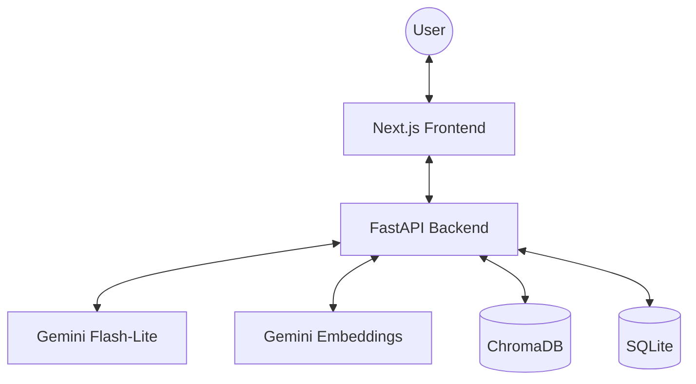

# Contexto

Chat with your documents using Retrieval-Augmented Generation (RAG). Upload a PDF or TXT file and ask questions about its content — **Contexto** finds the relevant context and answers using Gemini.


## 🚀 Features

- **Advanced RAG Pipeline**: Context-aware answers using Google's Gemini models.
- **Source Citations**: Every answer includes precise attribution to source documents.
- **Real-time Streaming**: Incremental response generation for a smooth UI experience.
- **Persistent History**: Multi-session support with auto-titling and SQLite persistence.
- **Robust Engineering**: Automated test suite (Pytest & Vitest) and GitHub Actions CI.
- **Fully Containerized**: Reliable deployment with Docker Compose.

## 🏗️ Architecture



## 🛠️ Stack

| Layer | Technology |
|---|---|
| **Frontend** | Next.js 14 (App Router), TypeScript, Tailwind CSS, v0.app |
| **Backend** | FastAPI, Python 3.12, LangChain (LCEL) |
| **LLM / Embeddings** | Google Gemini (Flash-Lite / Text-Embedding) |
| **Vector Store** | ChromaDB |
| **Persistence** | SQLite (AioSqlite) |
| **Testing** | Pytest (Backend), Vitest (Frontend) |
| **Infra** | Docker, GitHub Actions |

## 📐 Technical Decisions & Trade-offs

### Response Streaming (SSE)
We chose **Server-Sent Events (SSE)** over WebSockets for response streaming. SSE is more lightweight for one-way server-to-client streaming and handles reconnections natively via the `EventSource` protocol, making it ideal for LLM chat interfaces.

### Vector Storage: Local ChromaDB
For a portable portfolio project, **local ChromaDB** was preferred over cloud alternatives like Pinecone. This ensures the application remains fully self-contained and avoids external subscription dependencies while providing high-performance semantic search.

### Citations via Metadata
Citations are extracted directly from the document chunks' metadata during the retrieval phase. This ensures 100% factual attribution without relying on the LLM to "hallucinate" page numbers or filenames.

## 🏁 Getting Started

### Prerequisites

- Docker and Docker Compose
- A [Google AI API key](https://aistudio.google.com/app/apikey)

### Quick Start

```bash
cp .env.example .env
# Add your GOOGLE_API_KEY to .env

docker compose up
```

- Frontend: http://localhost:3000
- Backend API: http://localhost:8000/docs

## 🧪 Testing

The project maintains a rigorous testing standard to ensure reliability.

### Backend
```bash
cd backend
pytest
```

### Frontend
```bash
cd frontend
npm test
```

## 📁 Project Structure

```
├── .github/workflows/         # CI/CD Pipeline
├── backend/
│   ├── app/
│   │   ├── core/
│   │   │   ├── db.py          # SQLite persistence
│   │   │   ├── rag_chain.py   # Streaming RAG logic
│   │   │   └── ...
│   │   └── main.py            # FastAPI endpoints
│   └── tests/                 # Pytest suite
├── frontend/
│   ├── src/
│   │   ├── hooks/useChat.ts   # SSE streaming hook
│   │   └── components/        # UI components (v0.app)
│   └── vitest.config.ts       # Frontend test config
└── docker-compose.yml
```
